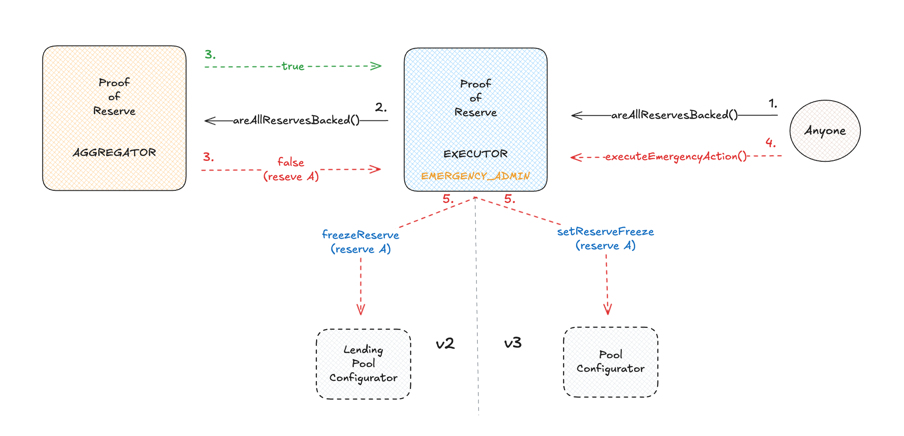

# Aave Proof of Reserve

[banner]

<br>

## Proof of Reserve overview

Proof of Reserve introduces a reliable way of verifying asset collateralization on-chain.

The Aave Proof of Reserve system is an extra safeguard for Pool reserves, monitoring the collateralization data published by the [Chainlink Proof of Reserve feeds](https://chain.link/proof-of-reserve) of on-chain, off-chain, and cross-chain backed assets. The system can quickly isolate an undercollateralized reserve, thereby protecting the remaining reserves in the pool.

<br>

## Proof of Reserve key components

The Aave Proof of Reserve comprises two main components:

- `ProofOfReserveAggregator`: This contract provides the data of reserves and their Chainlink Proof of Reserve data feed. It flags whether the reserves are collateralized by checking against the data provided by the Chainlink feed.
- `ProofOfReserveExecutor`: Its role is to monitor and freeze the reserve (or reserves) that the ProofOfReserveAggregator flagged as undercollateralized.

<br>

Other components of the Proof of Reserve system:

- `AvaxBridgeWrapper`: A contract-specific for the Avalanche network, it wraps the sum of the total supply of deprecated bridges with the active ones, providing the correct total supply of cross-chain assets.
- `Keeper`: Chainlink automation that monitors the reserves and can perform emergency actions through the ProofOfReserveExecutor.

<br>

## Technical overview of the smart contracts



### `ProofOfReserveAggregator`

The ProofOfReserveAggregator is the contract responsible for keeping the list of assets, their Proof of Reserve Chainlink feed, and their bridge wrapper in the case of assets with deprecated bridges. It is mainly used by each ProofOfReserveExecutor to validate whether any of the reserves set in this contract are undercollateralized by checking against its Proof of Reserve feed.

#### Access Control

-

#### Key Functions

-

### `ProofOfReserveExecutor`

#### Access Control

-

#### Key Functions

-

# SetUp

This repo has forge and npm dependencies, so you will need to install foundry then run:

```
forge install
```

and also run:

```
npm i
```

# Tests

To run the tests just run:

```
forge test
```

## License
