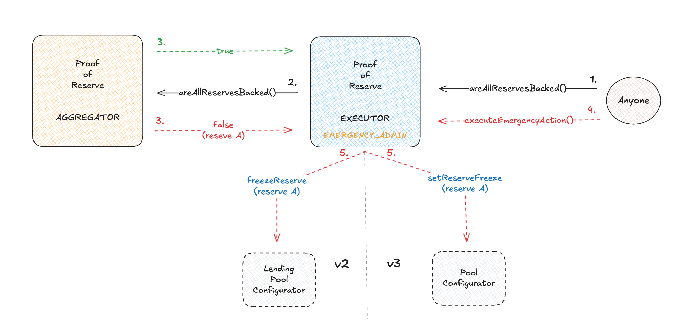

# Aave Proof of Reserve


<br>

## Proof of Reserve overview

Proof of Reserve introduces a reliable way of verifying asset collateralization on-chain.

The Aave Proof of Reserve system is an extra safeguard for Pool reserves, monitoring the collateralization data published by the [Chainlink Proof of Reserve feeds](https://chain.link/proof-of-reserve) of on-chain, off-chain, and cross-chain backed assets. The system can quickly isolate an undercollateralized reserve, thereby protecting the remaining reserves in the pool.

<br>

## Proof of Reserve key components

The Aave Proof of Reserve comprises two main components:

- `ProofOfReserveAggregator`: This contract provides the data of reserves and their Chainlink Proof of Reserve data feed. It flags whether the reserves are collateralized by checking against the data provided by the Chainlink feed.
- `ProofOfReserveExecutor`: Its role is to monitor and freeze the reserve (or reserves) that the ProofOfReserveAggregator flagged as undercollateralized.

<br>

Other components of the Proof of Reserve system:

- `AvaxBridgeWrapper`: A contract-specific for the Avalanche network, it wraps the sum of the total supply of deprecated bridges with the active ones, providing the correct total supply of cross-chain assets.
- `ProofOfReserveKeeper`: Chainlink automation that monitors the reserves and can perform emergency actions through the ProofOfReserveExecutor.

<br>

## Technical overview of the smart contracts



### `ProofOfReserveAggregator`

The ProofOfReserveAggregator is the contract responsible for keeping the list of assets, their Proof of Reserve Chainlink feed, and their bridge wrapper in the case of assets with deprecated bridges. It is mainly used by each ProofOfReserveExecutor to validate whether any of the reserves set in this contract are undercollateralized by checking against its Proof of Reserve feed.

#### Access Control

The contract uses OZ ownable for access control, which will be assigned to the Aave governance. The owner's role is to configure new assets, their Chainlink Proof of Reserve feeds, their margin, and if necessary, their bridge wrapper. It's also possible to remove assets.

#### Key Functions

- **`areAllReservesBacked`**

  - **purpose**: It flags whether all provided assets with Proof of Reserve enabled are still backed or not.
  - **functionality**:
    - Permissionless view function that iterates through a list of assets and checks the backing status of each.
    - It verifies whether the PoR feed’s latest answer is non-negative and whether the asset’s total supply does not exceed the feed’s reported supply plus a configured margin. If either condition fails, the asset is flagged as unbacked.
    - Returns a boolean indicating if all reserves are backed, and a list flagging each asset's backing status.

- **`enableProofOfReserveFeed`**

  - **purpose**: Adds a new reserve and its Proof of Reserve configuration with Chainlink PoR feed and margin.
  - **functionality**:
    - Only the owner can call this function.
    - It validates that this asset PoR was not previously configured, the addresses of the asset and feed are not the zero address, and the margin does not exceed the maximum margin allowed.
    - Stores in the assetsData mapping the feed address and margin.

- **`enableProofOfReserveFeedWithBridgeWrapper`**

  - **purpose**: Adds a new reserve with a bridge wrapper and its Proof of Reserve configuration with Chainlink PoR feed and margin.
  - **functionality**:
    - Only the owner can call this function.
    - It validates that this asset PoR was not previously configured, the addresses of the asset, feed and bridge wrapper are not the zero address, and the margin does not exceed the maximum margin allowed.
    - Stores in the assetsData mapping the bridge wrapper address, feed address and margin.

- **`setReserveMargin`**

  - **purpose**: Sets a new margin for a reserve that is already enabled.
  - **functionality**:
    - Only the owner can call this function.
    - Requires that the reserve already has a PoR feed configured and the new margin does not exceed the maximum margin allowed.
    - Stores in the assetsData mapping the new margin while keeping the same parameters for the feed and bridge wrapper.

- **`disableProofOfReserveFeed`**

  - **purpose**: Removes a reserve with PoR enabled.
  - **functionality**:
    - Only the owner can call this function.
    - Deletes the asset’s PoR feed, margin and bridge wrapper from storage.

<br>

### `ProofOfReserveExecutor`

#### Access Control

- The contract uses OZ ownable for access control, which will be assigned to the Aave governance. The owner's role is to enable or disable assets that will be monitored by the Executor.

#### Key Functions

- **`isEmergencyActionPossible`**

  - **purpose**: Determines whether the emergency action can be performed, with logic specific to each pool.
  - **functionality**:
    - Permissionless view function that uses the configured ProofOfReserveAggregator to check the collateralization status of the enabled assets in this contract.
    - For unbacked reserves, it checks whether the reserve is already frozen, and if is not, the emergency action can be triggered.
    - The Executor V2 includes an additional step that verifies whether any pool V2 reserves are borrowable. If so, the emergency action can also be triggered.

- **`executeEmergencyAction`**

  - **purpose**: Performs the emergency action, with logic specific to each pool.
  - **functionality**:
    - Permissionless function that uses the configured ProofOfReserveAggregator to get the collateralization status of the enabled assets in this contract and freeze undercollateralized reserves.
    - The Executor V2 includes an additional action that turns off borrowing of all pool V2 reserves.
    - To Executors be able to perform the emergency action they must be granted pool specific roles:
      - On V2: a `PROOF_OF_RESERVE_ADMIN` role must be granted to the Executor V2 via the Addresses Provider V2. Additionally, the Lending Pool Configurator must be upgraded to support the `PROOF_OF_RESERVE_ADMIN` role, enabling it to freeze reserves and disable borrowing.
      - On V3: The `EMERGENCY_ADMIN_ROLE` must be granted to the Executor via the ACL Manager, allowing the Executor V3 to perform the freeze action.

- **`enableAssets`**

  - **purpose**: Adds a list of reserves to be included in the monitoring and will be eligible for the emergency action.
  - **functionality**:
    - Only the owner can call this function.
    - It verifies that the reserve was not enabled before being stored in the assets array.

- **`disableAssets`**

  - **purpose**: Removes a reserve from the assets list that are monitored by this contract.
  - **functionality**:
    - Only the owner can call this function.
    - It verifies if the reserve is enabled and deletes it from the assets array.

  <br>

### `AvaxBridgeWrapper`

This contract is specific for the Avalanche network, as several reserves have a deprecated bridge coexisting with the actual one. This bridge wrapper contract is used to return to the ProofOfReserveAggregator the correct total supply of a reserve with deprecated bridges by summing the total supply of the actual and deprecated bridges.

#### Access Control

- The bridge addresses are set in the constructor during the deployment, meaning that this contract does not provide any setters that could change bridge addresses.

#### Key Functions

- **`totalSupply`**

  - **purpose**: Returns the real total supply of a cross-chain reserve.
  - **functionality**:
    - Permissionless view function that sums the total supply of the actual and deprecated bridge for the reserve to which this contract was deployed.

  <br>

### `ProofOfReserveKeeper`

This contract is Chainlink Automation compatible, which will execute the emergency action by constantly monitoring the Aave Proof of Reserve system through the Executors.

#### Key Functions

- **`checkUpkeep`**
  - **purpose**: Getter checked by Chainlink Automation to determine whether an emergency action should be performed by a specific ProofOfReserveExecutor.
  - **functionality**:
    - Accepts as input the encoded address of a ProofOfReserveExecutor contract and calls `areAllReservesBacked()` and `isEmergencyActionPossible()` to confirm that if a reserve is undercollateralized the emergency action can be triggered.
    - Returns true if both conditions are met. False otherwise.
- **`performUpkeep`**

  - **purpose**: Called by Chainlink Automation after the `checkUpkeep` indicates that the emergency action can be executed.
  - **functionality**:
    - Accepts as input the encoded address of a ProofOfReserveExecutor contract in which the emergency action will be performed and calls the `executeEmergencyAction()` function in the specific Executor.

  <br>

# Misc system's properties

- Margin is a percentage buffer applied to the Proof of Reserve feed data.
- A reserve is considered unbacked if the data provided by the feed plus a margin is less than the reserve's total supply.
- The margin can be zero, but it cannot exceed 10%.
- A reserve must be enabled in the Proof of Reserve Aggregator and Executor for the Emergency action to be possible.
- Reserves cannot be duplicated in the system.
- A reserve can only be enabled or disabled by the owner of the contracts.
- The Emergency action is permissionless and can be performed by anyone if the Aggregator flags at least one reserve as unbacked and unfrozen.

<br>

# Rationale on the margin parameter

Firstly, we should step back and understand the differences between Proof of Reserve feeds. We have three types of PoR feeds: off-chain reserves PoR feed, cross-chain reserves PoR feed, and on-chain reserves PoR feed.

- **Off-chain** reserves can be characterized as reserves stored in the real world, for example, US dollars in a bank backing issued stablecoins.
- **Cross-chain** reserves refer to assets in blockchain A that serve as backing for assets in another blockchain, B. For example, Bitcoin is stored in a BTC wallet, which issues BTC on Ethereum, or Aave tokens locked in a bridge, backing Aave on an L2 chain.
- The **on-chain** reserves are specifically for LSTs/LRTs that have their backing assets locked in a different layer of the chain. For example, LSTs on Ethereum are systems that lock ETH in the Beacon Chain to earn staking fees by securing the blockchain.

The previous system could cover both **off-chain** and **cross-chain** assets perfectly, as the source of those assets is updated first, and after the assets are issued. For example, the BTC amount is first moved to a specific BTC custody address, and after minting, meaning that it has more reserves than issued assets. To redeem the BTC, the BTC is first burned and then transferred from the BTC custody address to the user's BTC address.

However, for on-chain assets, specifically the different types of LSTs, we could identify deviations (up and down) of the total supply and total reserves by comparing the historical data of the asset and its PoR feed. While a total supply deviation below the total reserves is acceptable for the previous system, any deviation above the source data from Chainlink would trigger an emergency action that freezes the asset.

Checking how the stETH PoR works under the hood, the Chainlink proof of reserves DON every few minutes fetches the balance of all validators in the Consensus Layer, as well as the ETH in the Execution Layer (ETH in the Lido contract plus MEV rewards minus withdrawals), and calculates the total ETH that is covering stETH. At noon UTC, the Lido Oracle updates the stETH by checking the state of the execution and consensus layer, rebasing the stETH total supply, repaying node validations, and finalizing withdrawal requests. The two scenarios in which these deviations occur are when there is an update in the Lido Oracle and when the buffered ether is moved from stETH. For eETH, updates and rebases occur more frequently, every 6 hours, resulting in a higher number of deviations being observed.

Given the nature of these assets and the high on-chain activity, it's necessary to add a buffer on top of the source data of Chainlink feeds to correctly monitor the asset's collateralization and avoid unnecessary emergency actions.

In the tables below we select a few blocks that we could observe deviations that would trigger an emergency action.

**stETH**
| Block | Total Supply | Answer | Diff | Percentage |
| -------- | --------------- | --------------- | ---- | ---------- |
| 21989322 | 9372836.221084611513531133 | 9355872.392482988041820015 | 16963.828601623471711118 | 0.19% |
| 21992972 | 9379395.808086873131296832 | 9366167.275511780125648846 | 13228.532575093005647986 | 0.15% |
| 22051372 | 9346858.065625596068944123 | 9328689.639867760285459899 | 18168.425757835783484224 | 0.20% |
| 22055022 | 9322715.405406724376961322 | 9319621.746162086495884561 | 3093.659244637881076761 | 0.04% |
| 22058672 | 9328019.851897005516368775 | 9317059.961124252078020328 | 10959.890772753438348447 | 0.12% |
| 22248472 | 9370475.043364368272739260 | 9358349.863263813774480441 | 12125.180100554498258819 | 0.13% |
| 22252122 | 9375371.554306323483719697 | 9338880.298440962468700220 | 36491.255865361015019477 | 0.39% |
| 22255772 | 9325136.019890660609267699 | 9321065.117055607329825459 | 4070.902835053279442240 | 0.05% |
| 22259422 | 9326772.041337038123532051 | 9308666.511698527743535570 | 18105.529638510379996481 | 0.20% |
| 22263072 | 9307668.895483963341408940 | 9306697.697558236911724571 | 971.197925726429684369 | 0.02% |

**eETH**
| Block | Total Supply | Answer | Diff | Percentage |
| -------- | --------------- | --------------- | ---- | ---------- |
| 22051372 | 2243275.651611325744441112 | 2237439.880209789090302493 | 5835.771401536654138619 | 0.27% |
| 22055022 | 2268443.325132437083240863 | 2254602.469165715999451643 | 13840.855966721083789220 | 0.62% |
| 22058672 | 2286170.664888526331096600 | 2254602.469165715999451643 | 31568.195722810331644957 | 1.39% |
| 22062322 | 2305853.963233937755163197 | 2300395.701357155878485588 | 5458.261876781876677609 | 0.24% |
| 22489372 | 2518516.239520553483271283 | 2485696.415032386394114434 | 32819.824488167089156849 | 1.31% |
| 22493022 | 2528960.193940448419478780 | 2514805.228380033325695116 | 14154.965560415093783664 | 0.56% |
| 22580622 | 2614292.255111350703825018 | 2584092.014428180050615155 | 30200.240683170653209863 | 1.16% |
| 22584272 | 2620316.081847071366131083 | 2611004.155043179630121952 | 9311.926803891736009131 | 0.36% |
| 22587922 | 2650405.573796151187766880 | 2611004.155043179630121952 | 39401.418752971557644928 | 1.49% |
| 22591572 | 2681453.664575353073790808 | 2650896.595413163203203500 | 30557.069162189870587308 | 1.14% |

<br>

# SetUp

This repo has forge and npm dependencies, so you will need to install foundry then run:

```
forge install
```

and also run:

```
npm i
```

# Tests

To run the tests just run:

```
forge test
```

## License

Copyright © 2025, Aave DAO, represented by its governance smart contracts.

The [BUSL1.1](./LICENSE) license of this repository allows for any usage of the software, if respecting the Additional Use Grant limitations, forbidding any use case damaging anyhow the Aave DAO's interests.
Interfaces and other components required for integrations are explicitly MIT licensed.
