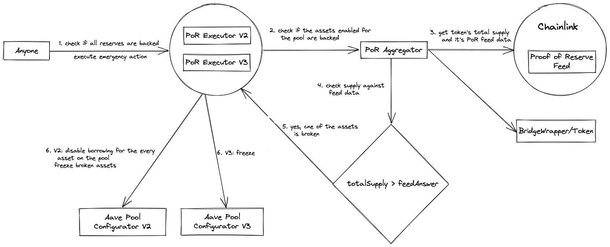

# Aave Proof of Reserve overview

Repository containing the necessary smart contracts to propose Proof of Reserve for AAVE v2/v3 pools.

Proof-of-Reserve is a system by Chainlink that allows for reliable monitoring of reserve assets, and usage of that data feed directly on-chain. If anomaly will be detected for a single asset, the system will try to apply the highest possible protections on the pool.



Below is the general flow of the proof of reserve check:

1. Anyone can call publicly opened method executeEmergencyAction() of the Executor for the desired pool.
2. The Executor asks the Aggregator if any of the reserves is unhealthy at the moment.
3. Aggregator compares total supply against Chainlink's Proof of Reserve feed for every token enabled in prior.
4. If at least one reserve is compromised, then
   - for Aave V2 Executor disables borrowing for every asset on the pool and freezes only the exploited assets.
   - for V3 LTV is set to 0 for the broken asset.

## Aggregator

A common [ProofOfReserveAggregator](./src/contracts/ProofOfReserveAggregator.sol) smart contract, acting as a registry of pairs (asset address, proof of reserve feed address) and also implementing and exposing a areAllReservesBacked() function, which, for a list of asset addresses does the validation of **proof of reserve feed value ≥ total supply of the asset**. If any asset passed on the list of inputs will not fulfill that requirement, the result of areAllReservesBacked() will be false. It is also possible to use the bridge wrapper to get the total supply, if the asset has two bridges on the network.

This contract is common, to be used by both Aave v2 and v3 systems, each one with different pool logic.

## Executors

- Each Aave v2 and Aave v3 pools will have their own associated smart contract implementing [ProofOfReserveExecutorBase](./src/contracts/ProofOfReserveExecutorBase.sol), exposing mainly 2 functions:
  1. areAllReservesBacked(). Returning at any time if all the assets with a proof of reserve feed associated are properly backed.
  2. executeEmergencyAction(). Callable by anybody and allowing to execute the appropriate protective actions on the Aave pool if areAllReservesBacked() would be returning a false value.
- The action to be executed on v2 is stopping borrowing of all the assets and freezing only the assets which did not pass proof of reserve validation.
- on v3 LTV will be set to 0 for the assets which did not pass proof of reserve validations.
- The [ProofOfReserveExecutorV3](./src/contracts/ProofOfReserveExecutorV3.sol) of Aave v3 will have riskAdmin permissions from the Aave v3 protocol, allowing this way to adjust LTV when the defined conditions are met.
- To allow the [ProofOfReserveExecutorV2](./src/contracts/ProofOfReserveExecutorV2.sol) of Aave v2 to halt borrowing and freeze exploited reserves, as the permissions system on Aave v2 is less granular than in v3, we have added a new role PROOF_OF_RESERVE_ADMIN on the v2 addresses provider smart contract, and updated the pool configurator contract to allow both the pool admin (previously) and the new proof of reserve admin (the ProofOfReserveExecutor of v2) to disable borrowing and freeze reserve.
- The addition/removal of assets with a proof of reserve will be controlled via the standard Aave governance procedures. Everything else (monitoring if all reserves are backed, execute the emergency action if not) is completely permissionless, algorithmically defined.

## Keeper

[ProofOfReserveKeeper](./src/contracts/ProofOfReserveKeeper.sol) contract which is compatible with [Chainlink ~~Keeper~~ Automation](https://docs.chain.link/docs/chainlink-automation/introduction/) to add more assurances on the execution timing.

> `performUpkeep()` won't be executed if it will consume more than 5m gas. Currently gas consumption is about 500k for six assets; eye should be kept on this metric upon adding of every new asset.

## AvaxBridgeWrapper

As for several assets on the Avalanche network deprecated bridge co-exist with the actual one, [AvaxBridgeWrapper](./src/contracts/AvaxBridgeWrapper.sol) was implemented to return the sum of supplies.

# Deployment

1. Changes to V2 pool to be deployed in advance.
2. [DeployProofOfReserveAvax.s.sol](./scripts/DeployProofOfReserveAvax.s.sol): This script will deploy Aggregator, Executors and Keeper contracts.
3. AvaxBridgeWrappers need to be deployed in advance for the every dual-bridge asset AAVE supports.
4. [ProposalPayloadProofOfReserve](./src/proposal/ProposalPayloadProofOfReserve.sol) will transfer all the permissions, enable assets for checking and register Upkeeps in Chainlink Automation.

# SetUp

This repo has forge and npm dependencies, so you will need to install foundry then run:

```
forge install
```

and also run:

```
npm i
```

# Tests

To run the tests just run:

```
forge test
```
