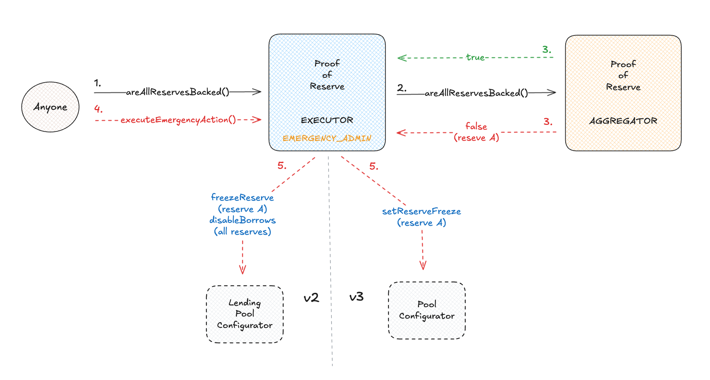

# Aave Proof of Reserve

[banner]

<br>

## Proof of Reserve overview

Proof of Reserve introduces a reliable way of verifying asset collateralization on-chain.

The Aave Proof of Reserve system is an extra safeguard for Pool reserves, monitoring the collateralization data published by the [Chainlink Proof of Reserve feeds](https://chain.link/proof-of-reserve) of on-chain, off-chain, and cross-chain backed assets. The system can quickly isolate an undercollateralized reserve, thereby protecting the remaining reserves in the pool.

<br>

## Proof of Reserve key components

The Aave Proof of Reserve comprises two main components:

- `ProofOfReserveAggregator`: This contract provides the data of reserves and their Chainlink Proof of Reserve data feed. It flags whether the reserves are collateralized by checking against the data provided by the Chainlink feed.
- `ProofOfReserveExecutor`: Its role is to monitor and freeze the reserve (or reserves) that the ProofOfReserveAggregator flagged as undercollateralized.

<br>

Other components of the Proof of Reserve system:

- `AvaxBridgeWrapper`: A contract-specific for the Avalanche network, it wraps the sum of the total supply of deprecated bridges with the active ones, providing the correct total supply of cross-chain assets.
- `Keeper`: Chainlink automation that monitors the reserves and can perform emergency actions through the ProofOfReserveExecutor.

<br>

## Technical overview of the smart contracts



### `ProofOfReserveAggregator`

The ProofOfReserveAggregator is the contract responsible for keeping the list of assets, their Proof of Reserve Chainlink feed, and their bridge wrapper in the case of assets with deprecated bridges. It is mainly used by each ProofOfReserveExecutor to validate whether any of the reserves set in this contract are undercollateralized by checking against its Proof of Reserve feed.

#### Access Control

The contract uses OZ ownable for access control, which will be assigned to the Aave governance. The owner's role is to configure new assets, their Chainlink Proof of Reserve feeds, their margin, and if necessary, their bridge wrapper. It's also possible to remove assets.

#### Key Functions

- **`areAllReservesBacked`**

  - **purpose**: It flags whether all provided assets with Proof of Reserve enabled are still backed or not.
  - **functionality**:
    - Permissionless view function that iterates through a list of assets and checks the backing status of each.
    - It verifies whether the PoR feed’s latest answer is non-negative and whether the asset’s total supply does not exceed the feed’s reported supply plus a configured margin. If either condition fails, the asset is flagged as unbacked.
    - Returns a boolean indicating if all reserves are backed, and a list flagging each asset's backing status.

- **`enableProofOfReserveFeed`**

  - **purpose**: Adds a new reserve and its Proof of Reserve configuration with Chainlink PoR feed and margin.
  - **functionality**:
    - Only the owner can call this function.
    - It validates that this asset PoR was not previously configured, the addresses of the asset and feed are not the zero address, and the margin does not exceed the maximum margin allowed.
    - Stores in the assetsData mapping the feed address and margin.

- **`enableProofOfReserveFeedWithBridgeWrapper`**

  - **purpose**: Adds a new reserve with a bridge wrapper and its Proof of Reserve configuration with Chainlink PoR feed and margin.
  - **functionality**:
    - Only the owner can call this function.
    - It validates that this asset PoR was not previously configured, the addresses of the asset, feed and bridge wrapper are not the zero address, and the margin does not exceed the maximum margin allowed.
    - Stores in the assetsData mapping the bridge wrapper address, feed address and margin.

- **`setReserveMargin`**

  - **purpose**: Sets a new margin for a reserve that is already enabled.
  - **functionality**:
    - Only the owner can call this function.
    - Requires that the reserve already has a PoR feed configured and the new margin does not exceed the maximum margin allowed.
    - Stores in the assetsData mapping the new margin while keeping the same parameters for the feed and bridge wrapper.

- **`disableProofOfReserveFeed`**

  - **purpose**: Removes a reserve with PoR enabled.
  - **functionality**:
    - Only the owner can call this function.
    - Deletes the asset’s PoR feed, margin and bridge wrapper from storage.

<br>

### `ProofOfReserveExecutor`

#### Access Control

- The contract uses OZ ownable for access control, which will be assigned to the Aave governance. The owner's role is to enable or disable assets that will be monitored by the Executor.

#### Key Functions

- **`isEmergencyActionPossible`**

  - **purpose**: Determines whether the emergency action can be performed, with logic specific to each pool.
  - **functionality**:
    - Permissionless view function that uses the configured ProofOfReserveAggregator to check the collateralization status of the enabled assets in this contract.
    - For unbacked reserves, it checks whether the reserve is already frozen, and if is not, the emergency action can be triggered.
    - The Executor V2 includes an additional step that verifies whether any pool V2 reserves are borrowable. If so, the emergency action can also be triggered.

- **`executeEmergencyAction`**

  - **purpose**: Performs the emergency action, with logic specific to each pool.
  - **functionality**:
    - Permissionless function that uses the configured ProofOfReserveAggregator to get the collateralization status of the enabled assets in this contract and freeze undercollateralized reserves.
    - The Executor V2 includes an additional action that turns off borrowing of all pool V2 reserves.

- **`enableAssets`**

  - **purpose**: Adds a list of reserves to be included in the monitoring and will be eligible for the emergency action.
  - **functionality**:
    - Only the owner can call this function.
    - It verifies that the reserve was not enabled before being stored in the assets array.

- **`disableAssets`**

  - **purpose**: Removes a reserve from the assets list that are monitored by this contract.
  - **functionality**:
    - Only the owner can call this function.
    - It verifies if the reserve is enabled and deletes it from the assets array.

# SetUp

This repo has forge and npm dependencies, so you will need to install foundry then run:

```
forge install
```

and also run:

```
npm i
```

# Tests

To run the tests just run:

```
forge test
```

## License
